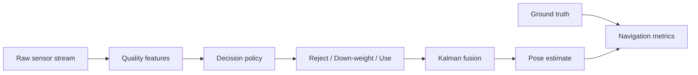

# Model Architecture Roadmap

## Objective

Build a navigation model that makes explicit decisions under sensor degradation:

- estimate UAV state,
- detect degraded sensor modes,
- choose sensor usage and measurement covariance,
- keep navigation error bounded during modality changes.

## Baseline Now

The implemented baseline uses a degradation-aware policy before a Kalman filter:

This is intentionally interpretable. Every rejected or down-weighted sensor has a
reason string attached to it.

## Learned Policy Next

After INSANE data is converted into aligned windows, replace or augment the rule
policy with a learned reliability model:

- Input window: IMU statistics, GNSS fix/HDOP/satellite count, VIO feature quality,
  UWB residuals, magnetometer norm/heading innovation, LRF validity/range, image
  exposure/brightness/blur proxies.
- Output: per-sensor reliability in `[0, 1]` and covariance multiplier.
- Training target: sensor error against ground truth over the next short horizon.
- Loss: reliability calibration plus navigation error after fusion.

Recommended first learned model: gradient-boosted trees or a small temporal MLP.
Recommended second model: GRU/Transformer encoder over 1-3 seconds of sensor health
features.

## INSANE Split Strategy

- Train: `indoor_1`, `indoor_2`, `transition_1`, `outdoor_1`, selected Mars traverses.
- Validation: `indoor_3`, `transition_2`.
- Test: `transition_3` and held-out Mars sequences.

This checks whether the policy generalizes to real sensor switching, not just one
trajectory.

## Safety Metrics

Track more than average RMSE:

- translation RMSE and 95th percentile error,
- outage recovery time after GNSS loss or visual degradation,
- false accept rate for degraded sensors,
- false reject rate for healthy sensors,
- covariance calibration: percentage of ground truth inside predicted confidence bounds,
- decision churn: how often the policy flips use/reject state.

